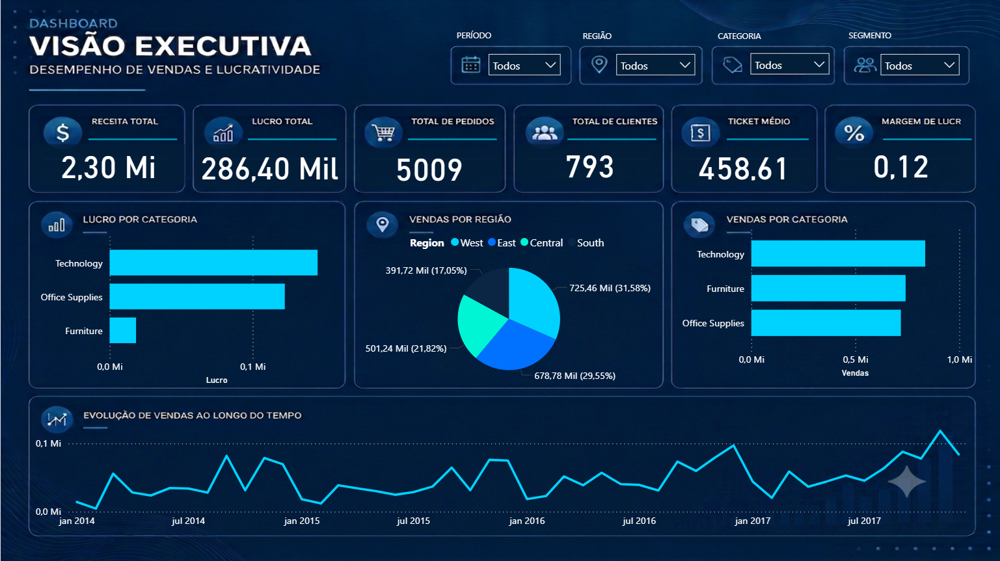
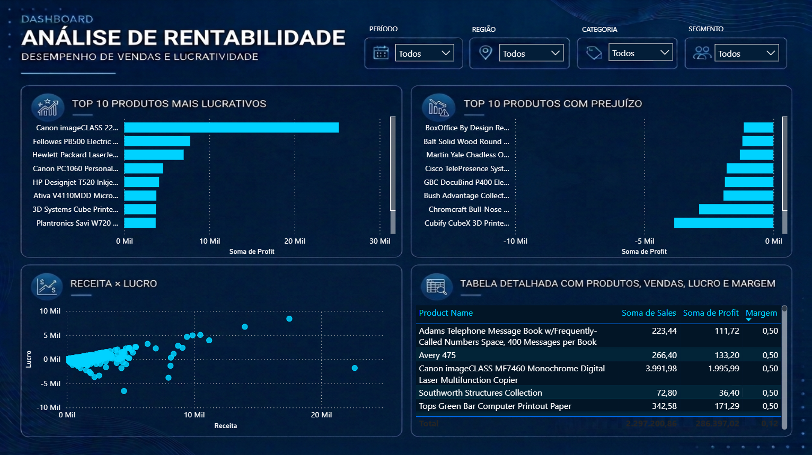

# 📊  Análise de Vendas e Lucratividade

## Índice

- [Sobre o Projeto](#sobre-o-projeto)
- [Objetivos](#objetivos)
- [Dataset](#dataset)
- [Tecnologias Utilizadas](#tecnologias-utilizadas)
- [Etapas do Projeto](#etapas-do-projeto)
- [Principais Insights](#principais-insights)
- [Recomendações](#recomendacoes)
- [Estrutura do Projeto](#estrutura-do-projeto)
- [Dashboard](#dashboard)
- [Dashboard](#dashboard)
- [Sobre mim](#sobre-mim)

## 📌 Sobre o Projeto

Este projeto foi desenvolvido com o objetivo de analisar o desempenho de vendas de uma empresa do setor varejista, identificando fatores que influenciam a receita e a lucratividade.

A análise foi conduzida utilizando Python para exploração e tratamento dos dados e Power BI para construção de um dashboard executivo, transformando dados em informações que apoiam a tomada de decisão.

## 🎯 Objetivos

Responder às seguintes perguntas de negócio:

 - Quais categorias geram mais receita e lucro?
 
 - Quais regiões apresentam melhor desempenho?

- Existem produtos que vendem muito, mas geram pouco lucro?

- Quais segmentos de clientes são mais rentáveis?

## 🗂️ Dataset

Base: Superstore Sales Dataset
Fonte: Kaggle

## 🛠️ Tecnologias Utilizadas

- Python
- Pandas
- NumPy
- Matplotlib
- Seaborn
- Power BI
- Jupyter Notebook

## 🔎 Etapas do Projeto

1. Importação dos dados

Leitura da base de dados e inspeção inicial das variáveis.

2. Limpeza dos dados

- Tratamento de valores ausentes
- Remoção de duplicidades
- Conversão de tipos de dados
- Criação de novas variáveis, como a Margem de Lucro (%)

3. Análise Exploratória (EDA)

- Foram realizadas análises de:
- Receita por categoria
- Lucro por categoria
- Receita por região
- Receita por segmento
- Top 10 produtos mais lucrativos
- Top 10 produtos com prejuízo
- Evolução das vendas ao longo do tempo
- Margem de lucro por categoria

4. Dashboard

Foi desenvolvido um dashboard executivo no Power BI composto por duas páginas:

Página 1 – Visão Executiva

- KPIs principais
- Receita por categoria
- Receita por região
- Receita por subcategoria
- Evolução da receita e do lucro

Página 2 – Análise de Rentabilidade

- Lucro por categoria
- Margem de lucro
- Top produtos lucrativos
- Produtos com prejuízo
- Receita × Lucro

## 📈 Principais Insights

A análise de lucratividade evidencia uma grande variação entre os pedidos. Enquanto alguns geram lucros elevados, outros apresentam margem negativa, indicando que determinadas vendas resultam em prejuízo para a empresa.

As vendas estão distribuídas de forma relativamente equilibrada entre as categorias de produtos. No entanto, essa distribuição não se reflete na lucratividade.

Embora Furniture represente uma participação de vendas semelhante às demais categorias, ela contribui com apenas 6,44% do lucro total, indicando uma rentabilidade significativamente inferior.

Entre os 10 produtos menos lucrativos, 4 pertencem à categoria Furniture, enquanto nenhum produto dessa categoria aparece entre os 10 mais lucrativos. Esse comportamento explica o baixo desempenho financeiro da categoria e indica a necessidade de revisar preços, descontos, custos ou até mesmo o portfólio de produtos.

A categoria Technology apresenta um comportamento distinto. Apesar de possuir 4 produtos entre os 10 menos lucrativos, ela concentra 8 dos 10 produtos mais lucrativos, demonstrando elevado potencial de geração de lucro quando comparada às demais categorias.

O segmento com maior lucratividade é o Consumer seguido do Corporate e por fim Home Office.

As regiões West e East concentram mais da metade das vendas da empresa e também apresentam os melhores resultados financeiros. Em contrapartida, South e Central possuem menor participação nas vendas e registram os menores níveis de lucro.

A análise temporal revela um padrão sazonal nas vendas. Observa-se um crescimento expressivo nos meses de novembro e dezembro, seguido por uma queda acentuada em janeiro, comportamento que pode estar relacionado às compras de fim de ano.

A relação entre vendas e lucro não é diretamente proporcional. Períodos ou produtos com elevado volume de vendas nem sempre geram maior lucratividade. Isso ocorre porque parte das vendas é realizada com margens reduzidas ou até mesmo negativas, reforçando a importância de monitorar indicadores de rentabilidade além do faturamento.

## 💡 Recomendações

Com base na análise, recomenda-se:

- Revisar produtos com margem negativa.
- Investigar fatores que impactam a baixa lucratividade da categoria Furniture.
- Expandir estratégias comerciais nas regiões com melhor desempenho.
- Priorizar produtos com maior margem de lucro.

## 📸 Dashboard

Página 1 – Visão Executiva

Página 2 – Visão Executiva

Página 3 – Análise de Rentabilidade

## 📂 Estrutura do Projeto

📁 Analise-Vendas 

│

├── data/

│   └── Sample - Superstore.csv

│

├── notebook/

│   └── analise_vendas.ipynb

│

├── dashboard/

│   └── analise_vendas.pbix

│

├── images/

│   ├── dashboard_executivo.png

│   └── dashboard_rentabilidade.png

│

└── README.md

### 🚀 Como Executar

- Clone este repositório.
- Instale as dependências:

    pip install pandas matplotlib seaborn numpy
- Execute o notebook no Jupyter Notebook ou Google Colab.

# 👩‍💻 Sobre Mim

Sou Engenheira Química em transição para a área de Dados, estou desenvolvendo projetos práticos para consolidar conhecimentos em Python, Power BI e análise de dados, com foco na construção de um portfólio voltado para oportunidades como Analista de Dados.

## Competências Demonstradas

✔ Limpeza e tratamento de dados

✔ Análise Exploratória de Dados (EDA)

✔ Storytelling com dados

✔ Visualização de dados

✔ Construção de dashboards

✔ Geração de insights de negócio

✔ Manipulação de dados com Pandas

✔ Agregações e métricas

✔ Desenvolvimento de KPIs

✔ Comunicação de resultados